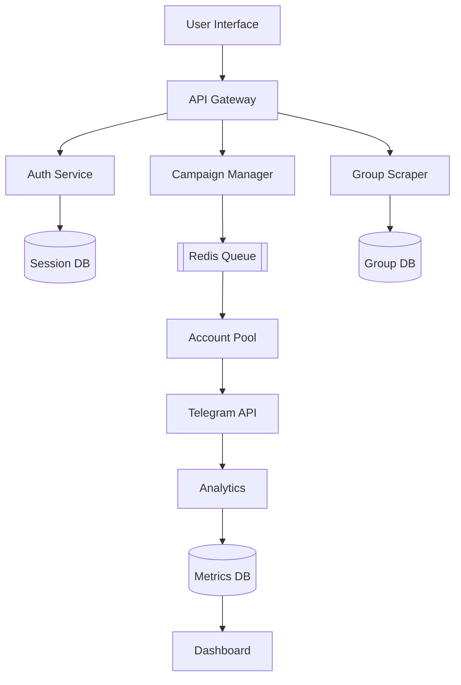

<!-- HEADER SECTION -->
<div align="center">
  <!-- Static header as fallback -->
  <h1>Tg-Promotion-Bot</h1>
  <p>⚡ Enterprise Telegram Automation | 🚀 Mass Messaging Solution</p>
  
  <!-- Animated badge that works on GitHub -->
  
  
  
</div>
  
</div>

<!-- BADGES -->
<div align="center">
  
  [](https://github.com/vedant1sharmaok/Tg-promotion-bot/stargazers)
  [](https://github.com/vedant1sharmaok/Tg-promotion-bot/network/members)
  [](LICENSE)
  [](https://python.org)
  [](https://docs.pyrogram.org)

  [](https://app.koyeb.com/deploy?type=git&repository=github.com/vedant1sharmaok/Tg-promotion-bot)
  [](https://t.me/yourchannel)
  
</div>

<!-- ANIMATED DIVIDER -->


## 🌟 Feature Galaxy

<table>
  <tr>
    <td width="33%">
      <h3> Smart Auth</h3>
      <ul>
        <li>🔐 Session String Login</li>
        <li>📱 OTP+Password Support</li>
        <li>🔄 Auto Session Backup</li>
        <li>🔑 AES-256 Encryption</li>
      </ul>
    </td>
    <td width="33%">
      <h3> Promotion Engine</h3>
      <ul>
        <li>💬 Dynamic Templates</li>
        <li>🖼️ Media Attachments</li>
        <li>⏱️ Precision Scheduling</li>
        <li>🌐 Geo-Targeting</li>
      </ul>
    </td>
    <td width="33%">
      <h3> Security</h3>
      <ul>
        <li>🛡️ Proxy Rotation</li>
        <li>🚨 Flood Protection</li>
        <li>📛 Account Rotation</li>
        <li>🔒 IP Obfuscation</li>
      </ul>
    </td>
  </tr>
</table>

<!-- SCREENSHOTS CAROUSEL -->
## 📸 Screenshot Showcase

<div align="center">
  
   
  
</div>

## 🏗️ Technical Architecture



## 🚀 Quick Start

```bash
# Clone with Git
git clone https://github.com/vedant1sharmaok/Tg-promotion-bot.git
cd Tg-promotion-bot

# Setup Virtual Environment
python -m venv venv
source venv/bin/activate  # Linux/Mac
# venv\Scripts\activate  # Windows

# Install dependencies
pip install -r requirements.txt

# Configure environment
cp .env.example .env
nano .env  # Edit with your credentials

# Initialize database
python -c "from database.db import init_db; init_db()"

# Start the bot
python main.py
```

## ⚙️ Configuration

```ini
# REQUIRED
API_ID=1234567
API_HASH=your_api_hash_here
BOT_TOKEN=123:your_bot_token

# OPTIMAL
ADMIN_IDS=vedant1sharmaok  # Your Telegram ID
PROXY_ENABLED=True
PROXY_LIST=proxy1.com:1080,proxy2.com:1080
MESSAGES_PER_HOUR=500  # Per account
```

## 👨‍💻 Developer Spotlight

<div align="center">
  <a href="https://github.com/vedant1sharmaok">
    
    <h2>Vedant Sharma</h2>
    <p>Lead Developer & Security Architect</p>
  </a>
  
  <div style="display: flex; justify-content: center; gap: 15px; margin: 20px 0;">
    <a href="https://twitter.com/yourhandle">
      
    </a>
    <a href="https://t.me/yourchannel">
      
    </a>
    <a href="mailto:your@email.com">
      
    </a>
  </div>
  
  <blockquote style="max-width: 600px; margin: 0 auto; padding: 15px; background: rgba(0,247,255,0.1); border-left: 4px solid #00F7FF; font-style: italic;">
    "Building tools that automate without compromising platform integrity or user experience."
  </blockquote>
</div>

## ⚠️ Critical Guidelines

<div style="background: rgba(255,0,0,0.1); border-left: 5px solid #FF0000; padding: 20px; border-radius: 0 8px 8px 0; margin: 30px 0;">
  <h3 style="color: #FF0000; margin-top: 0;">❗ ESSENTIAL RULES</h3>
  
  <ul style="padding-left: 20px;">
    <li><strong>STRICTLY FOLLOW</strong> <a href="https://core.telegram.org/api/terms" style="color: #00F7FF;">Telegram's ToS</a></li>
    <li><strong>MINIMUM 30 SECONDS</strong> between messages</li>
    <li><strong>ALWAYS USE PROXIES</strong> for multiple accounts</li>
    <li><strong>DISCLOSE AUTOMATION</strong> in group descriptions</li>
  </ul>
</div>

## 📜 License

```text
GNU GENERAL PUBLIC LICENSE
Version 3, 29 June 2007

This program comes with ABSOLUTELY NO WARRANTY.
This is free software, and you are welcome to redistribute it
under certain conditions. See the LICENSE file for details.

Additional Ethical Restrictions:
- Commercial use requires written permission
- Must disclose automated messaging
- No spamming or harassment
```

<!-- ANIMATED FOOTER -->
<div align="center">
  
  <p>© 2023 Tg-Promotion-Bot | Developed with ❤️ by <a href="https://github.com/vedant1sharmaok">Vedant Sharma</a></p>
</div>
```
